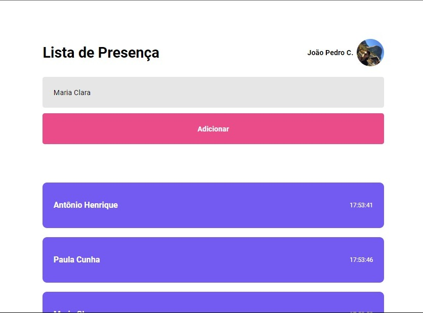

  
# Lista de Presença

 

## Descrição do Projeto
 

Lista de presença personalizável com marcação exata de data e hora.

<h1 align="center">
    <a href="https://pt-br.reactjs.org/">🔗 React</a>
</h1>

🚀 lib para construir interfaces do usuário com componentes reutilizáveis

 

### Features

- [x] Cadastro de convidado
- [x] Conexão com API do GitHub
- [ ] Excluir convidado

